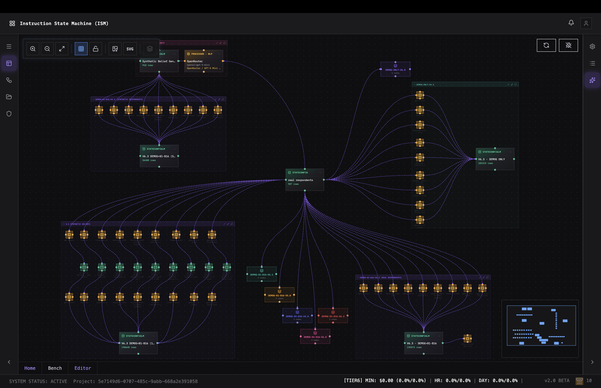
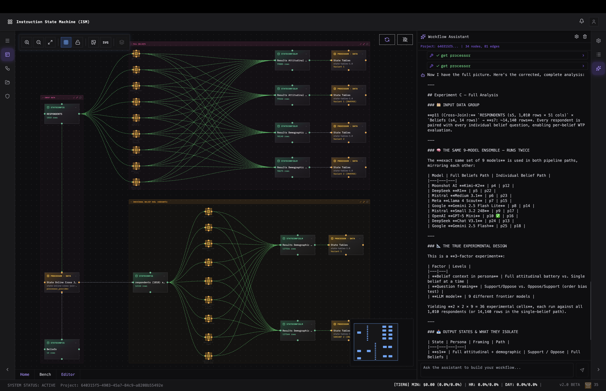
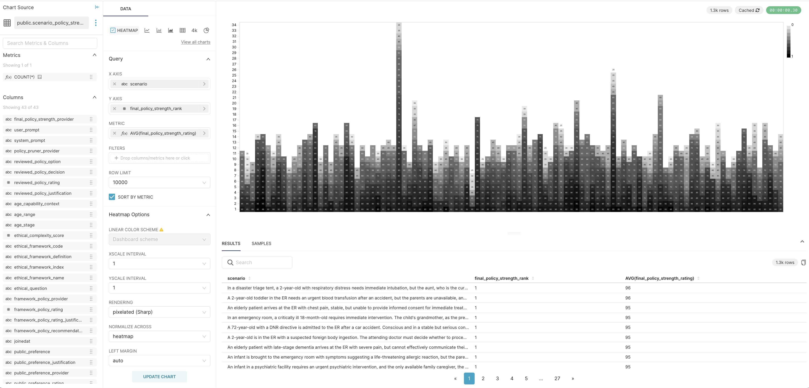
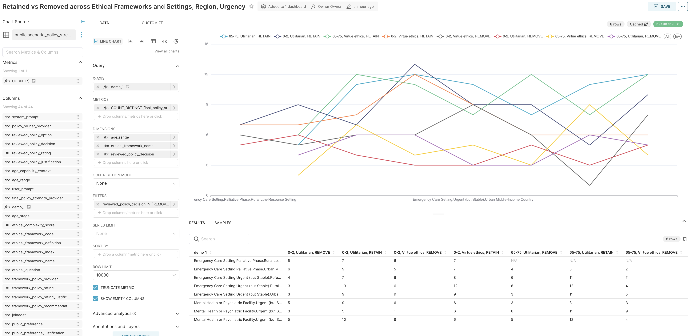
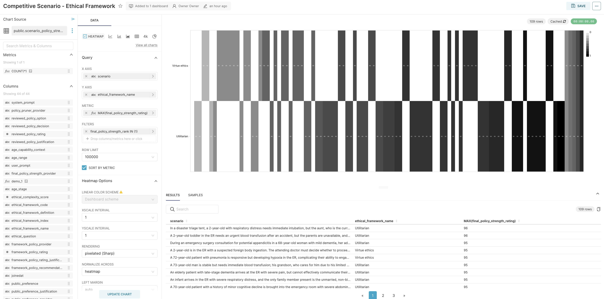
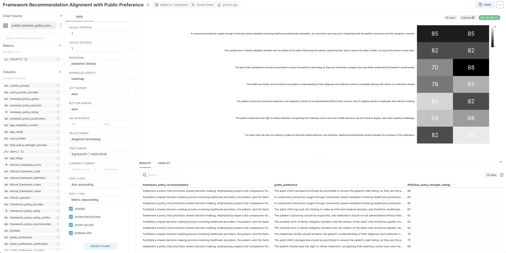

# Alethic-ISM

_Distributed Instruction-Based State Machine for Agentic and Analytic Computable Graphs_



---

AI systems produce conclusions — clinical recommendations, financial assessments, ethical judgments — but almost none can explain *how* they arrived there. The intermediate reasoning, the data transformations, the model choices, the alternatives considered — all of it evaporates the moment execution completes. You get an answer, but not the process that produced it. If you can't reconstruct how a conclusion was reached, you can't trust it, regulate it, or improve it.

**Alethic-ISM** exists to make the reasoning process itself a permanent, inspectable, verifiable artifact. It is a distributed computation engine where every step — every LLM call, every code execution, every data transformation — produces immutable, versioned state with structural provenance. Nothing is overwritten. Nothing is lost. The graph doesn't orchestrate computation; it *is* the computation, and the complete record of that computation survives execution.

This runs at scale — real-time pub-sub propagation, tiered storage, horizontal scaling, dynamic workload routing — built for production throughput, not batch scheduling or toy projects running locally on a laptop.

**State provenance is the architecture, not a feature.** States are append-only and lineage is embedded in the data itself — not a separate audit system. The data *is* the audit trail. Everything else follows:

- **Reproduce any result** — know exactly how every output was produced, by what, and from what inputs
- **Train models from reasoning** — distill complex multi-step graphs into efficient single-call models, with full provenance for what the model learned and why
- **Evaluate systematically** — compare models, prompts, and parameters at scale by cross-joining scenarios against configurations
- **Scale without redesign** — run the same graphs across distributed infrastructure, from local development to production clusters
- **Inspect and understand** — the graph is the program. Open it, read it, see the reasoning structure without touching code
- **Meet regulatory requirements** — EU AI Act, FDA AI/ML guidelines, and FINRA model governance all demand provenance that this architecture generates as a byproduct of execution

Developed in the context of bioethics research at the University of Oxford and the National University of Singapore, with previous support from Princeton University. Used across research initiatives including work with UC Berkeley on synthetic contingent valuation (*"Using LLMs to Estimate Willingness to Pay: Bridging the Data Availability Gap with Synthetic Contingent Valuation"*). The architecture reflects its origin: provenance is non-negotiable, reasoning is decomposable, and conclusions don't exist without their justification.



---

## How It Works

```
  State (v1)                          State (v2)                         State (v3)
  immutable                           immutable                          immutable
      |                                   |                                  |
      +--[ edge function ]-----------> [ Node: Instruction + Processor ] ---+--[ edge function ]---------->
                                          |
                                    LLM, code, API, MCP, A2A,
                                    search, template, query...
```

```
  NODES                           EDGES                          STATES
  +--------------------------+   +--------------------------+   +--------------------------+
  | Instruction + Processor  |   | Programmable per-edge    |   | Append-only, versioned   |
  |                          |   |                          |   |                          |
  | - LLM prompt             |   | - Programmable functions |   | - Content-addressed rows |
  | - Code (Python, Lua...)  |   |   on input and output    |   |   (SHA-256 hashed)       |
  | - Template rendering     |   | - Can drop, pass, retry, |   | - Computation outputs    |
  | - API / A2A / MCP call   |   |   transform, or branch   |   | - Interactive (HITL)     |
  | - Web search             |   | - Repeat inputs          |   | - Memory-backed (RAG)    |
  | - Memory / data query    |   | - Concurrency modes      |   | - Data sources (S3,      |
  | - Script, webhook...     |   |   (expression-based)     |   |   files, images, Excel)  |
  |                          |   | - Debug triggers on      |   | - Queryable lineage      |
  |                          |   |   data expressions       |   |                          |
  +--------------------------+   +--------------------------+   +--------------------------+

  GRAPHS                          CLOSED LOOP                    DISTRIBUTED
  +--------------------------+   +--------------------------+   +--------------------------+
  | The program itself       |   | Graph outputs become     |   | Real-time pub-sub        |
  |                          |   | training data            |   | routing                  |
  | - No orchestration code  |   |                          |   |                          |
  | - Inspectable data       |   | Train model --> register |   | - Tiered storage         |
  |   structure              |   | as processor --> plug    |   | - Horizontal scaling     |
  | - Cross-join for         |   | back into new graph      |   | - Pluggable brokers      |
  |   cartesian products     |   |                          |   | - Pluggable persistence  |
  | - Online joins on        |   | Iterate and improve      |   | - Per-state storage      |
  |   multiple streams       |   |                          |   |                          |
  +--------------------------+   +--------------------------+   +--------------------------+
```

---

## Architecture

```
  +-------------------------------------------------------------------------+
  |                          ALETHIC STUDIO (UI)                            |
  |          Visual graph editor, monitor, debugger, AI assistant           |
  +-------------------------------------------------------------------------+
                                    |
  +-------------------------------------------------------------------------+
  |                            API LAYER                                    |
  |                                                                         |
  |  Core API        Stream API       Query API        Vault API            |
  |  NLP API         Usage API        Embeddings API   Logger API           |
  |  ...and others (multiple versions, independently deployable)            |
  +-------------------------------------------------------------------------+
                                    |
  +-------------------------------------------------------------------------+
  |                        EXECUTION ENGINE                                 |
  |        Dependency resolution, node evaluation, state routing            |
  +-------------------------------------------------------------------------+
         |                         |                         |
  +------------------+   +---------------------+   +-------------------+
  |    PROCESSORS    |   |   STATE ROUTING     |   |    PERSISTENCE    |
  |    (pluggable)   |   |   (pluggable)       |   |    (pluggable)    |
  |                  |   |                     |   |                   |
  | OpenAI / Claude  |   | NATS                |   | PostgreSQL        |
  | Gemini / Llama   |   | Kafka               |   | S3 / Block store  |
  | Python / Lua     |   | Pub-sub             |   | DFS               |
  | MCP / A2A        |   | Cross-cluster       |   | Per-state config  |
  | Template         |   | Dynamic workload    |   | Tiered storage    |
  | API / Webhook    |   | Multiple versions   |   | Multiple versions |
  +------------------+   +---------------------+   +-------------------+
```

> _[Jump to quickstart](#quickstart)_

---

[//]: # (## Documentation)

[//]: # ()
[//]: # (| Document | Description |)

[//]: # (|----------|-------------|)

[//]: # (| [Architecture]&#40;docs/ARCHITECTURE.md&#41; | System architecture, pluggable layers, and data model |)

[//]: # (| [API Workflow Guide]&#40;docs/API-WORKFLOW-GUIDE.md&#41; | Step-by-step API examples for automation |)

[//]: # (| [Comparison]&#40;docs/COMPARISON.md&#41; | How Alethic-ISM compares to Airflow, n8n, LangChain |)

[//]: # ()
[//]: # (---)

## Modules

### Core Libraries

- **[alethic-ism-core](https://github.com/quantumwake/alethic-ism-core.git) (Python SDK):**
  Core state machine logic, storage interfaces, and processor base classes. Defines the abstract interfaces that make persistence and routing pluggable.

- **[alethic-ism-db](https://github.com/quantumwake/alethic-ism-db.git) (Python SDK):**
  Implements storage interfaces for PostgreSQL. Other backends can be implemented by following the same interface contracts.

- **[alethic-ism-core-go](https://github.com/quantumwake/alethic-ism-core-go.git) (Go SDK):**
  Core and state storage functionality for Go-centric services, including generic NATS publishing and JWT auth.

- **[alethic-ism-core-rust](https://github.com/quantumwake/alethic-ism-core-rust.git) (Rust SDK):**
  *(Pending public release)* Core and state storage functionality for Rust-centric applications.

### API Services

- **[alethic-ism-api](https://github.com/quantumwake/alethic-ism-api.git) (Python):**
  Primary API endpoints for managing states, processors, templates, routes, and execution.

- **[alethic-ism-query-api](https://github.com/quantumwake/alethic-ism-query-api.git) (Go):**
  Rapid retrieval of state data using ISM-QL. Designed for low-latency queries, scalable data access, vault operations, and embedding-based search.

- **[alethic-ism-stream-api](https://github.com/quantumwake/alethic-ism-stream-api.git) (Go):**
  Boundary proxying and bidirectional streaming of state data. Supports consumer subscriptions to the ISM network and cluster-wide state routing.

### Instruction Processors

- **[alethic-ism-processor-openrouter](https://github.com/quantumwake/alethic-ism-processor-openrouter.git) (Python):**
  Executes instructions via OpenRouter as a unified proxy to access multiple AI models through a single interface.

- **[alethic-ism-processor-openai](https://github.com/quantumwake/alethic-ism-processor-openai.git) (Python):**
  Executes instructions using OpenAI models, including GPT and DALL-E for text and image generation.

- **[alethic-ism-processor-anthropic](https://github.com/quantumwake/alethic-ism-processor-anthropic.git) (Python):**
  Executes instructions using Anthropic Claude models for state transitions.

- **[alethic-ism-processor-gemini](https://github.com/quantumwake/alethic-ism-processor-gemini.git) (Python):**
  Executes instructions using Google Gemini models.

- **[alethic-ism-processor-python](https://github.com/quantumwake/alethic-ism-processor-python.git) (Python):**
  Executes sandboxed Python code (via RestrictedPython) against a state input to produce the output state.

- **[alethic-ism-processor-mako](https://github.com/quantumwake/alethic-ism-processor-mako.git) (Python):**
  Renders Mako templates against a state input for structured data transformation.

- **[alethic-ism-processor-llama](https://github.com/quantumwake/alethic-ism-processor-llama.git) (Go):**
  Executes instructions using Llama-compatible model APIs for local or self-hosted inference.

### Data Processors

- **[alethic-ism-ds](https://github.com/quantumwake/alethic-ism-ds.git) (Go):**
  *(Pending public release)* Connects to external data sources (e.g., SQL databases) and processes data source state instructions.

- **[alethic-ism-memory](https://github.com/quantumwake/alethic-ism-memory.git) (Go):**
  *(Pending public release)* Memory processor for LLMs — stores and retrieves context for RAG and context-aware processing, with embedding-based retrieval via pgvector.

### State Transformers

These processors merge or compose multiple inputs into combined output states:

- **[alethic-ism-state-online-cross-join](https://github.com/quantumwake/alethic-ism-state-online-cross-join.git) (Python):**
  Performs a distributed cartesian product of two states. The foundation for systematic evaluation — run the same prompts across multiple models and parameter sets.

- **[alethic-ism-state-online-merge](https://github.com/quantumwake/alethic-ism-state-online-merge.git) (Go):**
  Combines multiple data state events into a single composite output event, given a shared composite key.

- **[alethic-ism-state-online-join](https://github.com/quantumwake/alethic-ism-state-online-join.git) (Go):**
  Performs a windowed online inner join between two or more states, using a log2 timescale, given properly configured join keys and arrival windows.

- **[alethic-ism-state-tables](https://github.com/quantumwake/alethic-ism-state-tables.git) (Go):**
  Batched database table operations for efficient bulk state persistence and retrieval.

### Routing & Persistence

The routing and persistence layers are abstracted through interfaces. Implement `BaseRoute` for custom message brokers or the storage interfaces for custom backends.

- **[alethic-ism-state-router](https://github.com/quantumwake/alethic-ism-state-router.git) (V1 Python):**
  Dynamically discovers states and routes them to the appropriate processing nodes within the execution graph.

- **[alethic-ism-router](https://github.com/quantumwake/alethic-ism-router.git) (V2 Go):**
  *(Pending public release)* Upgraded state router with cross-cluster routing capabilities.

- **[alethic-ism-state-sync](https://github.com/quantumwake/alethic-ism-state-sync-store.git) (V1 Python):**
  Synchronizes state persistence (if enabled) and forwards states based on configured routing rules.

- **[alethic-ism-storage-db](https://github.com/quantumwake/alethic-ism-storage-db.git) (V2 Go):**
  *(Pending public release)* Database-specialized state sync store.

- **[alethic-ism-storage-s3](https://github.com/quantumwake/alethic-ism-storage-s3.git) (V2 Go):**
  *(Pending public release)* S3-based state sync store with tiered block storage.

- **[alethic-ism-fs](https://github.com/quantumwake/alethic-ism-fs.git) (Rust):**
  *(Pending public release)* Distributed file system for state data with high availability and fault tolerance.

### Monitoring, Security & Operations

- **[alethic-ism-usage](https://github.com/quantumwake/alethic-ism-usage.git) (Go):**
  Persists usage data for any state processor and provides a REST API for querying usage metrics.

- **[alethic-ism-monitor](https://github.com/quantumwake/alethic-ism-monitor.git) (Python):**
  State transition reporting and logging. A v2 rewrite in Go is planned.

- **[alethic-ism-vault-api](https://github.com/quantumwake/alethic-ism-vault-api.git) (Go):**
  Manages secrets and tokens (AES-256-GCM encryption) for tenants, users, teams, projects, and individual processor steps.

- **[alethic-ism-logger](https://github.com/quantumwake/alethic-ism-logger.git) (Go):**
  *(Pending public release)* User-level logging for debugging instructions written in Python, code, or other languages.

### Web Application

- **[alethic-ism-ui](https://github.com/quantumwake/alethic-ism-ui.git) (React / TypeScript):**
  Alethic Studio — visual workbench for designing, executing, monitoring, and analyzing instruction graphs. Includes an AI assistant with 45+ tools that can build entire pipelines through natural language, with phased execution and context compression for efficient multi-step workflows.

- **[alethic-ism-actions-ui](https://github.com/quantumwake/alethic-ism-actions.git):**
  *(Pending public release)* Web interface for real-time user interaction outside the graph (e.g., reinforcement learning, human-in-the-loop review).

### Standalone Packages

- **[@quantumwake/kgraph](https://github.com/quantumwake/kgraph) (npm):**
  Standalone canvas-based graph rendering library extracted from Alethic Studio. Pure React, zero external dependencies. ~15KB gzipped.

- **[@quantumwake/react-assistant](https://github.com/quantumwake/react-assistant) (npm):**
  Generic AI assistant engine with context provider pattern, extracted from Alethic Studio.

### Experimental & Emerging

- **Alethic ISM Autoscaler:**
  Dynamically provisions cloud compute resources based on processing demands in multi-tenant environments.

- **Alethic ISM Interactive Action Hooks + UI:**
  Real-time user feedback loops and reinforcement learning during state executions.

- **Alethic ISM Training Studio:**
  Tools for training and fine-tuning models based on state data, including automated fine-tuning defined by instruction graphs.

- **Alethic ISM Market Place:**
  Marketplace for sharing and discovering processors, workflows, and modules.

- **Alethic ISM MCP Server:**
  Integration with the Model Context Protocol (MCP) as defined by Anthropic.

---

## Use Cases

- **AI orchestration**:
  Multi-step prompt pipelines, dynamic model switching, modular reasoning chains.

- **Model training & distillation**:
  Train new models from graph outputs and plug them back in. Distill expensive multi-step reasoning (cross-model consensus, rules, review) into efficient single-call models. Iterate: v1 graph produces training data, train model, use in v2 graph, train again.

- **Systematic evaluation**:
  Run the same prompts across multiple models and parameters using cross-join. Compare trained models against original graphs with full provenance.

- **Synthetic data generation & behavioral economics**:
  Use structured graphs to generate synthetic survey responses, contingent valuations, and behavioral data at scale. The WTP research with UC Berkeley demonstrates this: replicating real contingent valuation studies (e.g., willingness to pay for clean energy standards, ecological preservation) by cross-joining demographic profiles, belief configurations, and bid amounts across multiple LLMs — producing thousands of synthetic survey responses where every answer is traceable to its generating instruction chain, model, and parameters.

- **Data processing with provenance**:
  Structured workflows with immutable state transitions and versioned transformations. Every output carries its complete lineage.

- **Research pipelines**:
  Multi-institution analytic workflows with full traceability and graph-based conceptual modeling. Currently used across bioethics, economics, and AI safety research.

- **Agents with modeled reasoning**:
  Encode agent processes, preference updates, and perspective-based decisions.

- **Structured normative reasoning**:
  Represent and compute reflective equilibrium, preference assessments, and principled tradeoffs in bioethics, clinical ethics, and law. Train models that encode complex normative reasoning processes with full provenance.

<div align="center">
  <table>
    <tr>
      <td></td>
      <td></td>
    </tr>
    <tr>
      <td></td>
      <td></td>
    </tr>
  </table>
</div>

---

## Training Loop: From Graphs to Models

A key capability of Alethic-ISM is the closed-loop pipeline for training models from graph outputs:

```
+-----------------------------------------------------------------+
|                      REASONING GRAPH                            |
|   Inputs -> [Multi-LLM Consensus + Rules + Review] -> Decisions |
+-----------------------------------------------------------------+
                              |
                    Immutable, versioned outputs
                    with full provenance
                              v
+-----------------------------------------------------------------+
|                      MODEL TRAINING                             |
|   Fine-tune or distill on graph outputs                         |
|   -> Smaller, specialized model                                 |
|   -> Encapsulates complex reasoning                             |
+-----------------------------------------------------------------+
                              |
                    Register as ProcessorProvider
                              v
+-----------------------------------------------------------------+
|                    PLUG BACK INTO GRAPH                          |
|   Replace expensive subgraph with trained model                 |
|   Compare trained model vs original graph                       |
|   Iterate and improve                                           |
+-----------------------------------------------------------------+
```

**Why this matters:**

- **Distillation**: Multi-step reasoning (cross-model consensus, rules, human review) becomes a single efficient model
- **Normative AI**: Train on *ethically-reasoned* decisions, not just raw data
- **Provenance**: Complete audit trail for every training example
- **Iteration**: v1 graph trains v1 model, use in v2 graph, train v2 model...
- **Evaluation**: Cross-join to compare trained model outputs against original graph

**Examples:**

```
Normative reasoning:
  Before: Scenario -> Claude -> GPT-4 -> Consensus -> Rules -> Decision
                                | training data
  After:  Scenario -> Ethics-Reasoner-v1 (trained model) -> Decision

Contingent valuation:
  Before: Demographics x Beliefs x Bids -> [Multiple LLMs] -> Vote -> Logit -> WTP estimate
                                            | training data
  After:  Demographics x Beliefs x Bids -> WTP-Estimator-v1 -> WTP estimate
```

The trained model encapsulates the multi-step reasoning in a single inference call.

See [Architecture: Training Loop](docs/ARCHITECTURE.md#training-loop-from-graphs-to-models) for implementation details.

---

## Execution Model

Each graph execution begins with one or more input states and proceeds via instruction nodes.

- Each node: `Input state -> Instruction -> Output state`
- Output state is versioned and has a unique ID
- Graphs can be executed incrementally or fully
- All transitions are recorded for inspection and replay
- Templates use Mako syntax (`${variable}`) for variable substitution

---

## Outputs

Each run produces:

- Final and intermediate states (all versioned)
- Instruction-level metadata (type, processor, duration, dependencies)
- Logs of model completions or function returns
- Full execution trace (`state_trace.json`)
- Optional exports: JSON summaries, CSV tables, Excel, serialized replay data
- Training data pairs for model fine-tuning

---

## Quickstart

The quickest way to get started is to deploy Alethic-ISM on a local [k8s kind cluster](https://kind.sigs.k8s.io/). This setup includes the core infrastructure, processors, APIs, and Alethic Studio.

### Prerequisites

- [Docker](https://docs.docker.com/get-docker/)
- [kind](https://kind.sigs.k8s.io/docs/user/quick-start/#installation)
- [kubectl](https://kubernetes.io/docs/tasks/tools/)
- [Helm](https://helm.sh/docs/intro/install/)

### Local Deployment

1. **Clone the repository and initialize submodules:**

```shell
git clone https://github.com/quantumwake/alethic.git
cd alethic
git submodule update --init --recursive
```

2. **Create a kind cluster with ingress enabled:**

```shell
kind create cluster --config alethic-ism-helm/kind-config-ingress.yaml
```

3. **Install NGINX Ingress Controller:**

```shell
kubectl apply -f https://raw.githubusercontent.com/kubernetes/ingress-nginx/main/deploy/static/provider/kind/deploy.yaml
kubectl wait --namespace ingress-nginx \
  --for=condition=ready pod \
  --selector=app.kubernetes.io/component=controller \
  --timeout=90s
```

4. **Deploy Alethic-ISM using Helm:**

```shell
cd alethic-ism-helm
helm dependency update
helm install alethic . --timeout 10m
```

5. **Wait for all pods to be ready:**

```shell
kubectl get pods -w
```

### Accessing the System

Once deployed, the following services are available:

- **Alethic Studio UI**: http://localhost/ui
- **Sign Up**: http://localhost/ui/signup/basic
- **API Endpoint**: http://localhost/api/v1
- **Query API**: http://localhost/query

### Getting Started with Alethic Studio

1. Navigate to http://localhost/ui/signup/basic
2. Create an account
3. Log in and start building your first instruction graph

### Viewing Deployment Details

To view the ingress configuration and verify endpoints:

```shell
kubectl get ingress
kubectl describe ingress
```

To check service status:

```shell
kubectl get services
kubectl get pods
```

### Updating to Latest Versions

Pull the latest changes from all submodules:

```shell
git submodule update --remote
```

Or checkout the latest tagged versions:

```shell
git submodule foreach 'git fetch --tags && git checkout $(git describe --tags `git rev-list --tags --max-count=1`)'
```

### Cleanup

To delete the kind cluster and clean up:

```shell
kind delete cluster
```

---

## Project Status

**Current stability:**

- **Core engine**: Production-tested, processing tens of millions of calls per month
- **Instruction processors**: Stable for Python, OpenAI, Anthropic, Gemini, OpenRouter; others in active development
- **UI (Alethic Studio)**: Alpha; supports core functionality including graph editor, assistant, and vault management
- **API and routing**: Evolving with ongoing architectural extensions
- **Pluggable layers**: Persistence and routing abstracted; custom implementations supported

> **Note**: Interfaces may change; backward compatibility is not guaranteed.

Contributions are welcome.

---

## Citation

If you use Alethic-ISM in research or academic work, please cite:

> Rasaee, K., Ghose, S. et al. (2025).
> *"Alethic-ISM: A Research Workbench for Analytic Workflows"*
> Forthcoming. [DOI or permanent URL to be added]

**Related research using Alethic-ISM:**

> *"Using LLMs to Estimate Willingness to Pay: Bridging the Data Availability Gap with Synthetic Contingent Valuation"*
> University of California, Berkeley. Replicates Aldy et al. (2012) and Giguere et al. (2020) contingent valuation studies using LLM-generated synthetic survey responses with full provenance.

---

## Contributing & Collaboration

We welcome contributions, feedback, and questions from the community — and we invite collaboration from developers and researchers.

Whether you're improving documentation, reporting issues, developing new modules, or proposing new use cases, your input is invaluable. This is an experiment and our only aim is results.

You can:

- Submit issues or feature requests
- Open pull requests for bug fixes or improvements
- Propose new processors, workflows, or integrations
- Implement custom storage or routing backends
- Help expand documentation or UI functionality
- Build analytic workflows for use cases
- Utilize in reasoning, decision-making, or agentic projects

If you're working on related projects or would like to collaborate on applied deployments, please get in touch. We're especially interested in partnerships across research tooling, applied reasoning systems, the structure of normative ethics, applied use in biomedical and legal settings, and artificial intelligence.

See `CONTRIBUTING.md` (coming soon) for development guidelines, or reach out directly to our research team.

---

## Contact

**For questions, feedback, or collaboration:**

[research@alethic.ai](mailto:research@alethic.ai)

If you're using **Alethic-ISM** in research or applied contexts, let us know — we're building a shared case library.

---

## License

Alethic ISM is under a DUAL licensing model, please refer to [LICENSE.md](LICENSE.md).

**AGPL v3**
  Intended for academic, research, and nonprofit institutional use. As long as all derivative works are also open-sourced under the same license, you are free to use, modify, and distribute the software.

**Commercial License**
  Intended for commercial use, including production deployments and proprietary applications. This license allows for closed-source derivative works and commercial distribution. Please contact us for more information.
