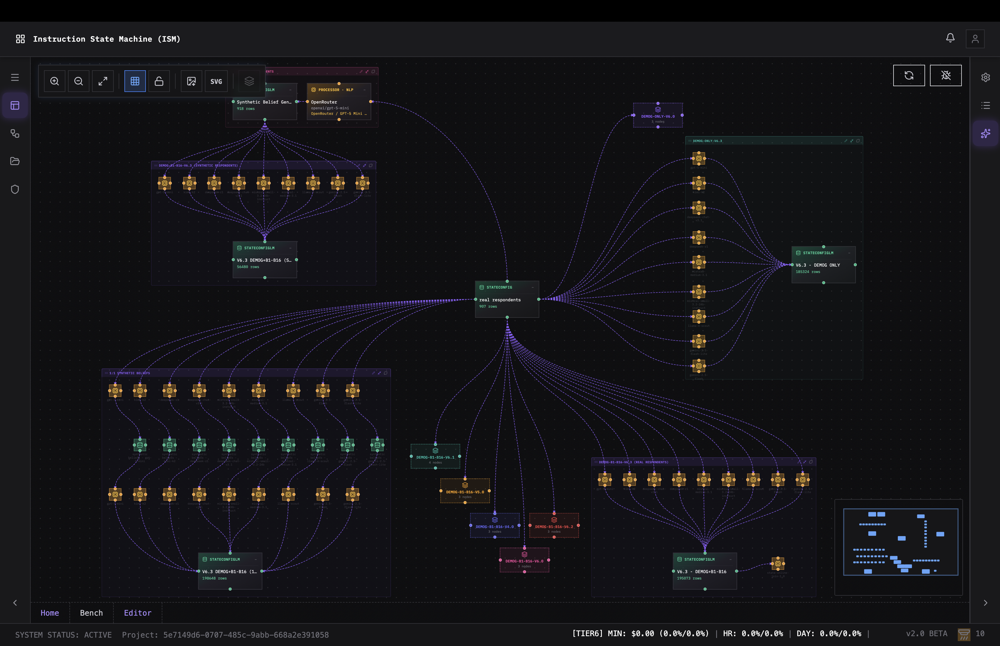
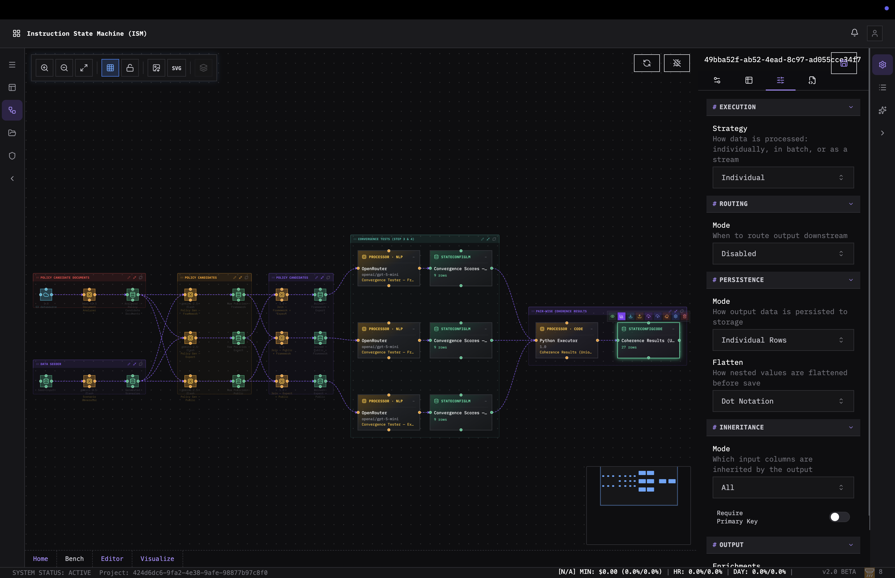
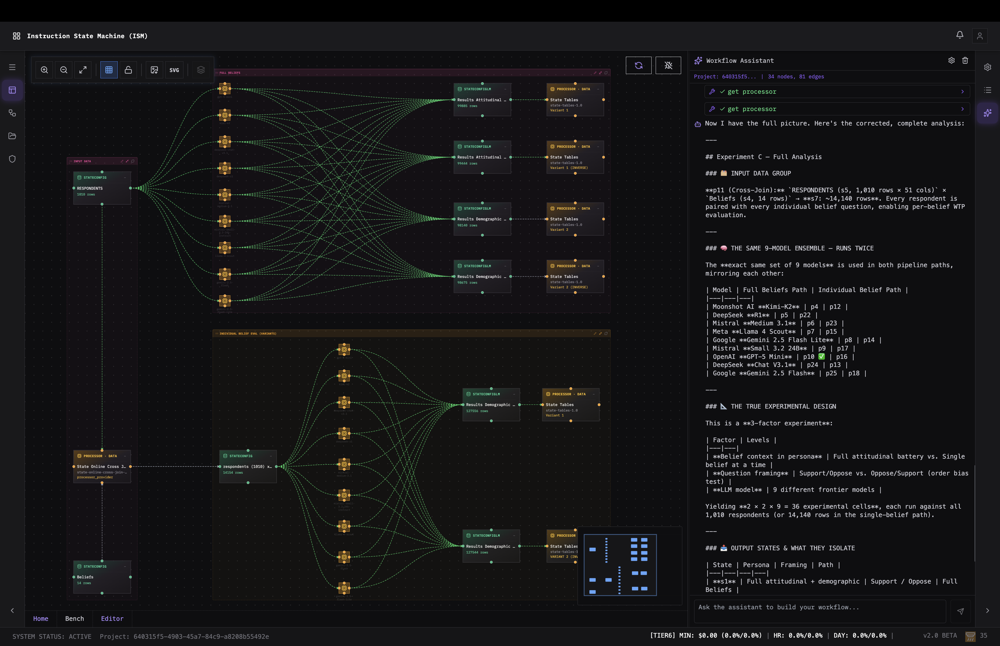
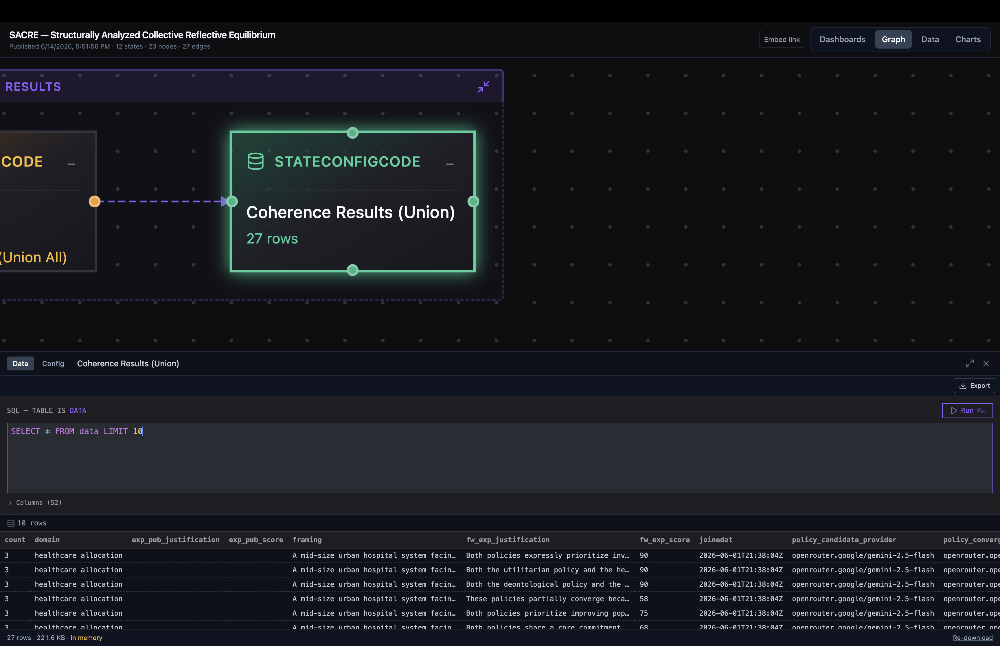
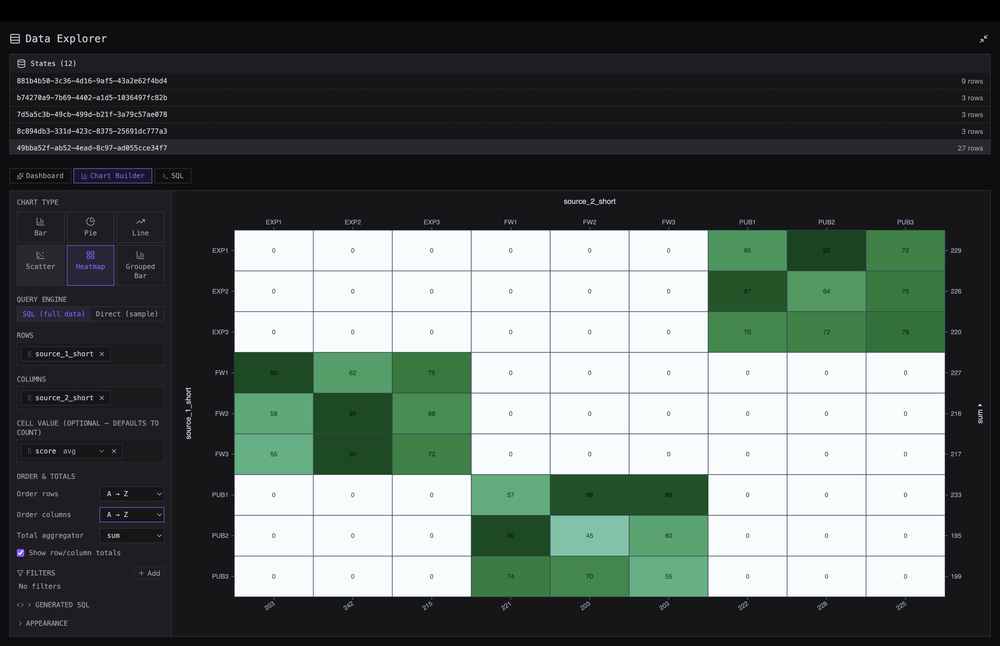

# ALETHIC ISM

_Distributed Instruction-Based State Machine for Agentic and Analytic Computable Graphs_

**Alethic ISM is a substrate for computation** — a foundational, domain-neutral layer to build on, in the same spirit as the [relational model](https://en.wikipedia.org/wiki/Relational_model) that underlies databases or the [actor model](https://en.wikipedia.org/wiki/Actor_model) that underlies concurrent systems. Concretely, it is a distributed, instruction-based [state machine](https://en.wikipedia.org/wiki/Finite-state_machine): each step applies an instruction to immutable input data and yields immutable output data, and the resulting graph is at once the program, its execution, its full history, and the dataset it produced — a single object you can inspect, distribute, learn from, and even distill into a model that becomes a building block in another program. Everything else — provenance, the processors, the publishing tier, even the application domains below — is built on top of this foundation, not part of it.

To date, Alethic ISM has processed **over 500 million data points** — primarily across academic domains, with a handful of commercial applications now in trial — comfortably handling sparse data across hundreds of columns and millions of rows per state.

---

The application domains demonstrate generality; they are not the purpose of the system. Alethic-ISM originated in bioethics and AI research at the University of Oxford, the National University of Singapore, and Princeton University. The same primitives have since been applied to substantially different problems, each implemented as a program within ISM:

<table>
<tr>
<td width="50%" valign="top">

#### SACRE — Bioethics

*Structurally Analyzed Collective Reflective Equilibrium · evolved from CREP*

Computes the most coherently justified policy for a scenario by reconciling **public preferences, expert judgment, and ethical frameworks**.

</td>
<td width="50%" valign="top">

#### Synthetic Contingent Valuation — Economics

*with the University of California, Berkeley*

Uses LLMs as **synthetic survey populations** to estimate willingness to pay — *"Bridging the Data Availability Gap with Synthetic Contingent Valuation."*

</td>
</tr>
<tr>
<td width="50%" valign="top">

#### End-of-Life Study — Clinical Ethics

*~340 clinicians, predominantly Singapore*

Compares clinicians' initial positions on withholding/withdrawing treatment and **CANH** for newborns and children against an **AI-assisted re-evaluation** across multiple models.

</td>
<td width="50%" valign="top">

#### AnimaLLM — Animal Ethics

*the system's original application*

Measures the **degree of consideration** language models extend to animals across subjects, framings, and normative perspectives.

</td>
</tr>
</table>

That the same set of primitives expresses normative reasoning, behavioral economics, clinical decision-making, and animal ethics equally well indicates that the primitives — rather than any individual application — constitute the system's contribution.

> **A note on this repository.** This open-source repository tracks a stable baseline of the system. Active development currently takes place in a closed-source line that has moved substantially ahead, with significantly more capability across the state-storage, publishing, and Studio tiers. Selected features are upstreamed over time, and further components may be opened in the future. For research, academic, or commercial use — including access to capabilities that run ahead of this baseline — please [reach out](#contact).

---

## What Alethic-ISM Is

Conventional systems treat four artifacts as distinct: the program (source code), its execution (a running process), its record (logs), and the data it produces (output). Alethic-ISM unifies them. Computation is expressed as a directed graph in which each node applies an instruction, executed by a processor, to an immutable input state and yields a new immutable output state. The resulting graph simultaneously constitutes the program, its execution, its complete history, and the dataset that the computation produced: a single immutable, inspectable object. The graph does not orchestrate the computation; it constitutes it.

Two properties follow directly from this design, rather than from additional tooling:

- **The program is data.** A graph can be read, composed, routed, distributed, queried, and replayed, by either a person or an automated system. Because the graph is the program, its reasoning structure is legible without reference to the underlying code.
- **The computation is self-recording, and programs compose.** Each state is immutable and its lineage is embedded in the data, so execution inherently produces a training signal. A program can be distilled into a model and registered as a processor — a single instruction that other programs invoke — so an entire graph becomes a reusable building block inside another. Programs produce models, and those models become parts of further programs; the loop closes by construction.

As with any model of computation — the relational model, the actor model, or the spreadsheet — Alethic-ISM is domain-neutral; one computes within it. Instructions are polyglot and pluggable: an LLM prompt, sandboxed code (Python or Lua), a template, an API / MCP / A2A call, a web search, a data query, a webhook, a relational operator (join, cross-join, merge), or a previously trained model. Storage and routing are likewise pluggable. Provenance, reproducibility, and auditability are not objectives in themselves; they are consequences of representing computation, its record, and its data as the same immutable object. The system operates at production scale, with real-time publish–subscribe propagation, tiered storage, horizontal scaling, and dynamic workload routing.

Because the program, its data, and its record are the same object, the entire lifecycle lives in one place. The same graph can be built and run, its results transformed and analyzed, then refined and run again — looped as many times as the work demands — and finally published as an interactive dataset, without ever leaving the system and with the whole process distributed across the cluster. Authoring, execution, analysis, and publishing are not separate tools stitched together; they are one continuous loop over a single substrate.

---

## Published Results

Any project in Alethic-ISM can be frozen into an immutable snapshot and published as a read-only, fully interactive result — graph, dashboards, charts, and the underlying data — at a stable share link. Published results render entirely in the browser (client-side query engine over the snapshot's columnar data), so a link is a self-contained, reproducible artifact: the same provenance you ran with, shareable and citable.

This is how we surface the outputs of our scientific, social, and ethics research — every figure traceable back to the instruction graph, model, and parameters that generated it.

  <table>
    <tr>
      <td align="center"></td>
      <td align="center"></td>
    </tr>
  </table>

<i>Click an image to open it full size.</i>

- **Example** (a simple, illustrative snapshot): [Multi-model reasoning result →](https://ism.quantumwake.io/p/V2-5aJNUWaGpPG7Hra_k29gVQ49V0Zy5BHWo9BE-QqI)

> Published results are produced by the publishing tier (publish API + viewer + dashboard service) and back the public research artifacts at `ism.quantumwake.io/p/…`.

---

## Use Cases

- **AI orchestration**:
  Multi-step prompt pipelines, dynamic model switching, modular reasoning chains.

- **Model training & distillation**:
  Train new models from graph outputs and plug them back in. Distill expensive multi-step reasoning (cross-model consensus, rules, review) into efficient single-call models. Iterate: v1 graph produces training data, train model, use in v2 graph, train again.

- **Systematic evaluation**:
  Run the same prompts across multiple models and parameters using cross-join. Compare trained models against original graphs with full provenance.

- **Synthetic data generation & behavioral economics**:
  Use structured graphs to generate synthetic survey responses, contingent valuations, and behavioral data at scale. The WTP research with UC Berkeley demonstrates this: replicating real contingent valuation studies (e.g., willingness to pay for clean energy standards, ecological preservation) by cross-joining demographic profiles, belief configurations, and bid amounts across multiple LLMs — producing thousands of synthetic survey responses where every answer is traceable to its generating instruction chain, model, and parameters.

- **Data processing with provenance**:
  Structured workflows with immutable state transitions and versioned transformations. Every output carries its complete lineage.

- **Research pipelines & publishing**:
  Multi-institution analytic workflows with full traceability and graph-based conceptual modeling. Freeze and [publish results](#published-results) as immutable, citable, interactive artifacts. Currently used across bioethics, economics, and AI safety research.

- **Agents with modeled reasoning**:
  Encode agent processes, preference updates, and perspective-based decisions.

- **Structured normative reasoning**:
  Represent and compute reflective equilibrium, preference assessments, and principled tradeoffs in bioethics, clinical ethics, and law. Train models that encode complex normative reasoning processes with full provenance.

---

## Documentation

Deeper material lives in dedicated documents so this README stays focused:

- **[Architecture](docs/ARCHITECTURE.md)** — system model, execution flow, processors, and the pluggable routing/persistence layers *(work in progress; under revision)*
- **[Quickstart](docs/QUICKSTART.md)** — local Kubernetes deployment walkthrough *(stale — the open-source deploy path lags the closed-source version)*
- **[Modules](docs/MODULES.md)** — the full component list across libraries, APIs, processors, storage, and UI
- **[Comparison](docs/COMPARISON.md)** — how Alethic ISM relates to workflow and LLM-orchestration tools
- **[API Workflow Guide](docs/API-WORKFLOW-GUIDE.md)** — building and running graphs through the API

---

## System Health

A snapshot of current maturity across the system. Detailed, per-module scoring lives in the team's [System Health & Evaluation Framework](https://github.com/quantumwake/alethic) (purpose, engineering, and lifecycle lenses).

| Tier | Status | Notes |
|------|--------|-------|
| **Core engine & state machine** | Production | Production-tested at scale — over 500 million data points processed to date (tens of millions of calls/month); immutable, lineage-tracked state |
| **Core libraries** (Python, Go) | Production | `core` / `db` (Python) stable; `core-go` actively expanded as the Go backbone |
| **Instruction processors** | Stable | Python, OpenAI, Anthropic, Gemini, OpenRouter, Mako, Llama all stable; edge functions (Lua) stable |
| **State storage (StateFS)** | Beta | New Go columnar/tiered store; deployed and in active hardening (memory tuning, compaction) |
| **API & routing** | Stable / Evolving | Core, query, stream, vault, usage stable; NLP, dashboard, publish APIs newer and active |
| **Publishing & sharing** | Beta | Snapshot/publish/viewer tier live and backing public research artifacts; durability hardening ongoing |
| **Studio (UI)** | Beta | Graph editor, dashboards, assistant, project management functional and actively developed |
| **Pluggable layers** | Available | Persistence and routing abstracted; custom backends supported |

**Open source vs. active development:** the tiers above describe the full system. The open-source baseline tracks a stable subset; the state-storage, publishing, and Studio tiers run further ahead in the closed-source line (see the note near the top of this README). For access or collaboration, [reach out](#contact).

> **Note**: Interfaces are still evolving; backward compatibility is not guaranteed. Contributions are welcome.

---

## Citation

If you use Alethic-ISM in research or academic work, please cite:

> Rasaee, K., Ghose, S. et al. (2025).
> *"Alethic-ISM: A Research Workbench for Analytic Workflows"*
> Forthcoming. [DOI or permanent URL to be added]

**Related research using Alethic-ISM:**

> *"Using LLMs to Estimate Willingness to Pay: Bridging the Data Availability Gap with Synthetic Contingent Valuation"*
> University of California, Berkeley. Replicates Aldy et al. (2012) and Giguere et al. (2020) contingent valuation studies using LLM-generated synthetic survey responses with full provenance.

Published, interactive result artifacts are available at `ism.quantumwake.io/p/…` — see [Published Results](#published-results).

---

## Contributing & Collaboration

We welcome contributions, feedback, and questions from the community — and we invite collaboration from developers and researchers.

Whether you're improving documentation, reporting issues, developing new modules, or proposing new use cases, your input is invaluable. This is an experiment and our only aim is results.

You can:

- Submit issues or feature requests
- Open pull requests for bug fixes or improvements
- Propose new processors, workflows, or integrations
- Implement custom storage or routing backends
- Help expand documentation or UI functionality
- Build analytic workflows for use cases
- Use Alethic-ISM in reasoning, decision-making, or agentic projects

If you're working on related projects, want access to the modules that run ahead of the open-source baseline, or would like to collaborate on applied or commercial deployments, please get in touch. We're especially interested in partnerships across research tooling, applied reasoning systems, the structure of normative ethics, applied use in biomedical and legal settings, and artificial intelligence.

---

## Contact

**For questions, feedback, collaboration, or access:**

[research@alethic.ai](mailto:research@alethic.ai)

If you're using **Alethic-ISM** in research or applied contexts, let us know — we're building a shared case library.

---

## License

Alethic ISM is under a DUAL licensing model, please refer to [LICENSE.md](docs/LICENSE.md).

**AGPL v3**
  Intended for academic, research, and nonprofit institutional use. As long as all derivative works are also open-sourced under the same license, you are free to use, modify, and distribute the software.

**Commercial License**
  Intended for commercial use, including production deployments and proprietary applications. This license allows for closed-source derivative works and commercial distribution. Please contact us for more information.
</content>
