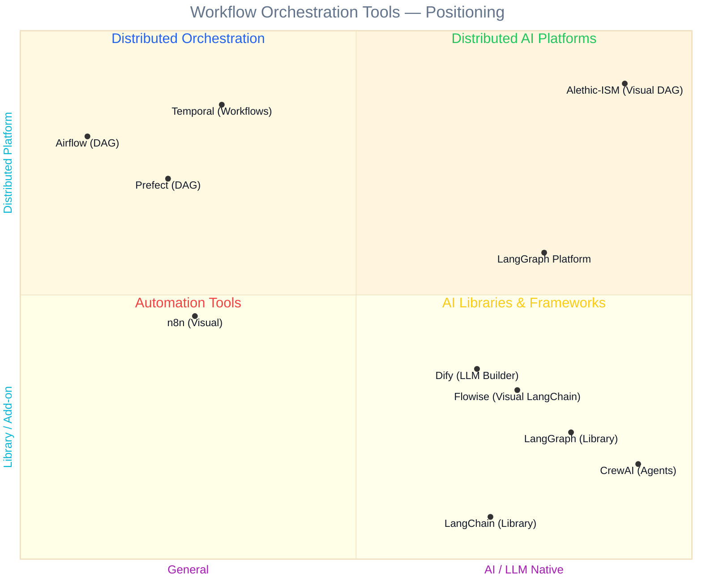
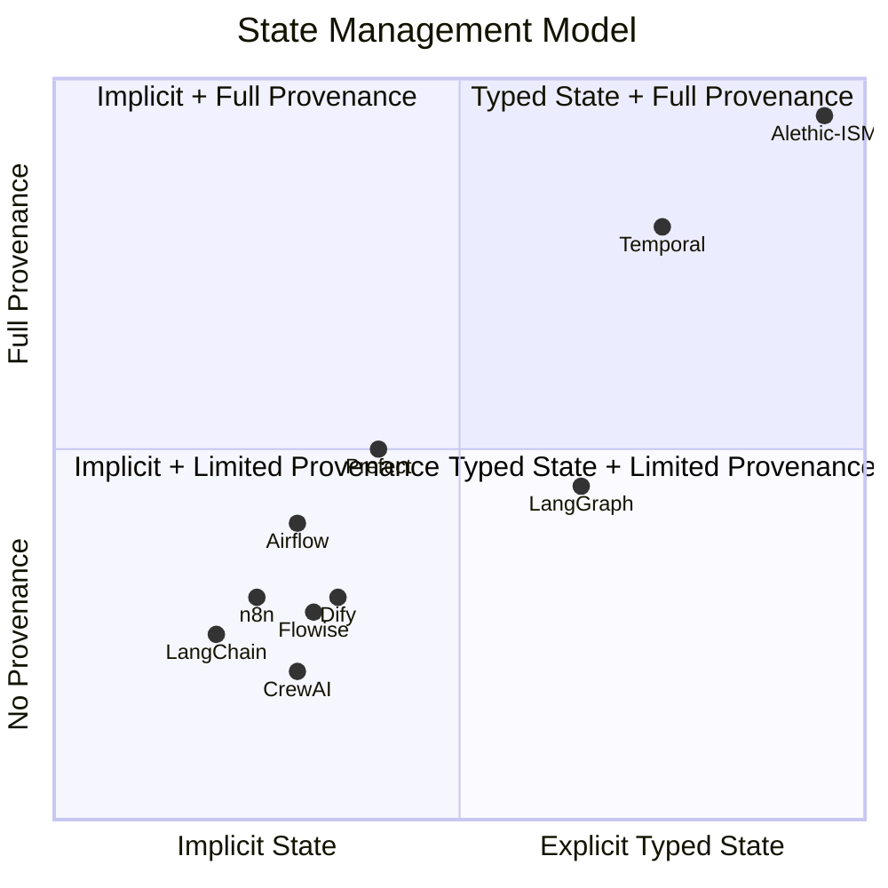
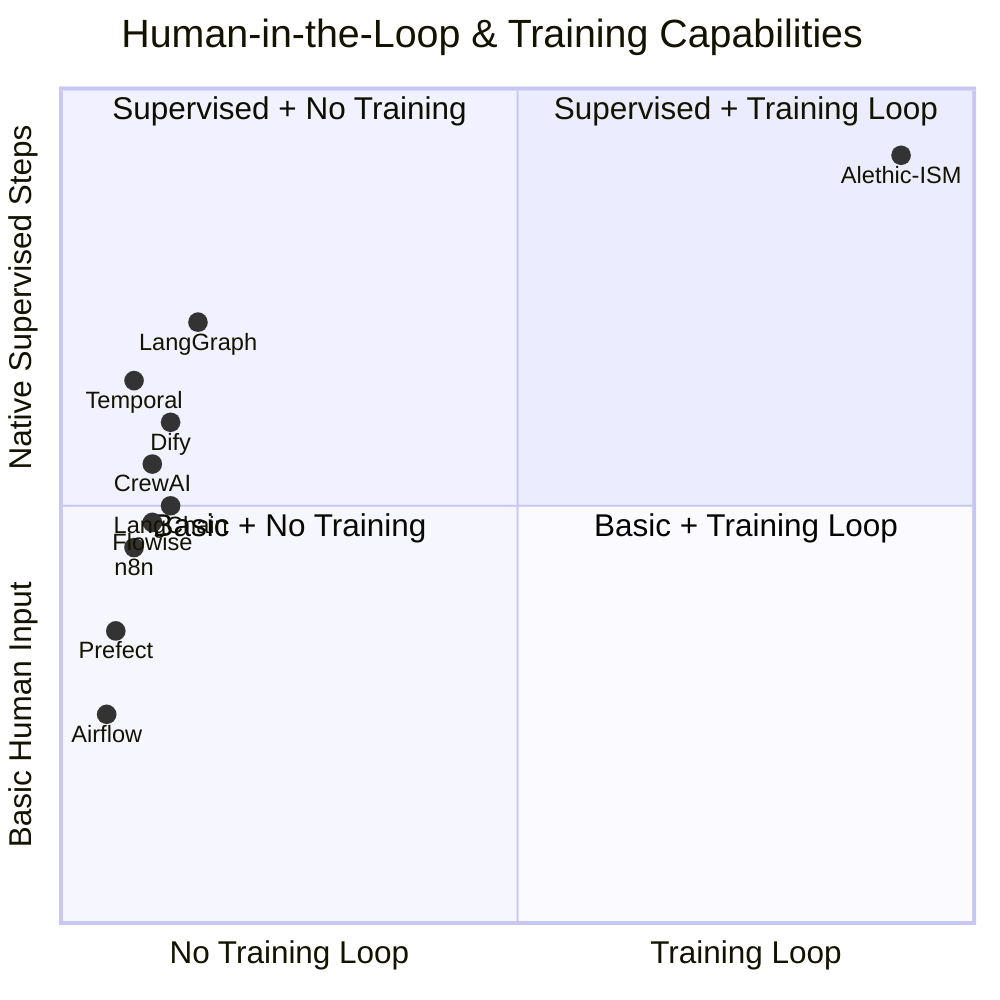
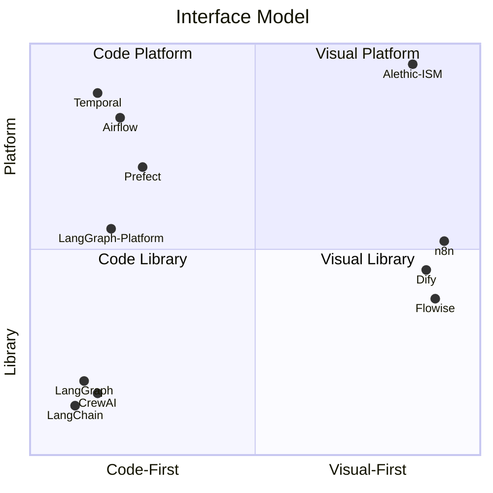

# Alethic-ISM vs. Workflow Orchestration Tools

This document compares Alethic-ISM with popular workflow orchestration tools to help understand where it fits in the ecosystem.

---

## Positioning Quadrant

The following quadrant positions tools based on two key dimensions:

- **Y-Axis (Distribution Model)**: How the tool scales and deploys
  - **Distributed Platform**: Native horizontal scaling, multi-tenant, message broker routing, Kubernetes-native
  - **Library (Single Process)**: Runs in application process, manual scaling, no built-in distribution

- **X-Axis (Domain Focus)**: What the tool is optimized for
  - **General Purpose**: Integrations, ETL, automation, broad applicability
  - **AI/LLM Native**: Built specifically for AI workflows, multi-model, reasoning



**Legend**:
- **Quadrant Colors**: 🟢 Distributed AI Platforms | 🔵 Distributed Orchestration | 🔴 Automation Tools | 🟡 AI Libraries & Frameworks
- **Interface**: Visual DAG = drag-drop canvas | Code-First = Python/YAML | Visual LangChain = no-code LLM builder

### Understanding the Y-Axis: Distribution Model

| Level | Description | Examples |
|-------|-------------|----------|
| **First-Class Distributed** | Distribution is core architecture, not an add-on. Multi-tenant, message broker routing, horizontal scaling built-in from day one. | Alethic-ISM |
| **Configurable Distributed** | Requires executor/queue mode configuration. Distribution is possible but not the default architecture. | Airflow (Celery/K8s executors), n8n (queue mode) |
| **Platform Add-on** | Core is a library; distribution requires separate managed platform or significant infrastructure setup. | LangGraph Platform (separate from library) |
| **Library (Single Process)** | Runs in application process. Scaling is entirely your responsibility. | LangGraph (library), LangChain |

### Quadrant Breakdown

| Quadrant | Position | Tools | Characteristics |
|----------|----------|-------|-----------------|
| **Upper Right** | First-Class Distributed + AI Native | **Alethic-ISM** | Native multi-tenant, NATS/Kafka routing, K8s-native, pluggable storage per-state |
| **Upper Left** | Distributed + General | **Airflow** | Celery/K8s executors, DAG scheduling, ETL. Distribution via executor config. |
| **Middle** | Configurable/Platform | **n8n** (queue mode), **LangGraph Platform** | Scaling available but requires setup or managed service |
| **Lower Right** | Library + AI Native | **LangGraph** (library), **LangChain** | Single process, embed in your app, manual scaling |

### Tool Distribution Details

| Tool | Distribution Model | First-Class? | Multi-Tenancy | Scaling Approach |
|------|-------------------|--------------|---------------|------------------|
| **Alethic-ISM** | Native distributed (NATS/Kafka, K8s) | **Yes** | Built-in | Horizontal, automatic, per-state storage |
| **Temporal** | Native distributed (gRPC, K8s) | **Yes** | Built-in | Horizontal worker pools, sharded history |
| **Airflow** | Executor-based (Celery/K8s) | Partial | Limited | Worker pools via executor config |
| **Prefect** | Hybrid (Cloud + agents) | Partial | Via Cloud | Work pools, agent-based |
| **LangGraph Platform** | Managed service | No (add-on) | Via platform | Auto-scales up to 10 containers (managed) |
| **n8n** | Queue mode (Redis/Bull) | No | Enterprise only | Requires EXECUTIONS_MODE=queue + Redis |
| **Dify** | Single instance / K8s | No | Limited | Manual K8s deployment |
| **Flowise** | Single instance / Docker | No | None | Manual deployment |
| **LangGraph** (library) | Single process | No | None | Manual implementation |
| **CrewAI** | Single process | No | None | Manual implementation |
| **LangChain** | Single process | No | None | Manual implementation |

> **Key Insight**: Alethic-ISM is the only **AI-native** tool with **first-class distributed** architecture. While Temporal offers first-class distribution for general workflows, Alethic-ISM uniquely combines native distribution with LLM orchestration, typed immutable states, full provenance, and the training loop capability.

---

## Supporting Dimensions

The primary quadrant captures Distribution vs Domain Focus. The following charts capture additional dimensions:

### State Management & Provenance



| Tool | State Model | Provenance |
|------|-------------|------------|
| **Alethic-ISM** | First-class typed states with schema, immutable, versioned | Full - every transition logged, complete audit trail |
| **Temporal** | Workflow state with event sourcing | Strong - full event history, replay capability |
| **LangGraph** | Explicit state with checkpointing | Partial - checkpoint replay, LangSmith tracing |
| **Prefect** | Task results, artifacts | Partial - flow run history, artifacts |
| **Airflow** | XComs for task data passing | Limited - task logs, DAG run history |
| **Dify** | Conversation/workflow state | Limited - execution logs |
| **Flowise** | Conversation/chatflow state | Limited - execution logs |
| **n8n** | JSON objects between nodes | Limited - execution logs |
| **CrewAI** | Agent memory, implicit | Limited - optional logging |
| **LangChain** | Memory objects, implicit | Limited - LangSmith tracing optional |

### Human-in-the-Loop & Training Loop



| Tool | Human-in-the-Loop | Training Loop |
|------|-------------------|---------------|
| **Alethic-ISM** | Native supervised steps, action hooks, real-time feedback | **Yes** - graph outputs → train model → deploy as processor → iterate |
| **LangGraph** | Interrupt and resume, human-as-tool | No |
| **Temporal** | Signals, queries, await human input | No |
| **Dify** | Annotation/feedback UI | No (but supports fine-tuning data export) |
| **CrewAI** | Human input tool | No |
| **Flowise** | Human input node | No |
| **LangChain** | Human tool pattern | No |
| **n8n** | Wait nodes, form triggers | No |
| **Prefect** | Manual approval flows | No |
| **Airflow** | Manual triggers only | No |

### Interface & Deployment Model



| Tool | Primary Interface | Deployment |
|------|-------------------|------------|
| **Alethic-ISM** | Visual (Alethic Studio) + API | Platform (microservices) |
| **Dify** | Visual LLM app builder | Single instance / K8s |
| **Flowise** | Visual LangChain builder | Single instance / Docker |
| **n8n** | Visual workflow builder | Single instance / Queue mode |
| **Temporal** | Code (Go/Java/Python SDKs) | Platform (server + workers) |
| **Airflow** | Code (Python DAGs) + UI | Platform (scheduler + workers) |
| **Prefect** | Code (Python) + UI | Hybrid (Cloud + agents) |
| **LangGraph Platform** | Code + Studio | Managed platform |
| **LangGraph** | Code (Python) | Library |
| **CrewAI** | Code (Python) | Library |
| **LangChain** | Code (Python) | Library |

### Key Distinction: LangChain vs LangGraph vs Alethic-ISM

| Aspect | LangChain | LangGraph | Alethic-ISM |
|--------|-----------|-----------|-------------|
| **Paradigm** | Linear chains, sequential | Stateful graphs with cycles | State machine, immutable transitions |
| **State Model** | Implicit (memory objects) | Explicit with checkpoints | First-class, typed, versioned |
| **Control Flow** | Chain of calls | Graph nodes with conditional edges | Processor routes with propagation |
| **Persistence** | External | Built-in checkpointing | Pluggable, per-state configurable |
| **Distribution** | Single process | Single process (manual scaling) | **Native distributed** (NATS, K8s) |
| **Multi-tenancy** | Application-level | Application-level | **Built-in multi-tenant** |
| **Deployment** | Library (embed in app) | Library (embed in app) | Platform (microservices) |
| **Use Case** | Simple LLM apps, RAG | Complex agents | Research, production AI workflows |

### Why Alethic-ISM Occupies Unique Space

```
┌─────────────────────────────────────────────────────────────────────────────────────┐
│                                                                                     │
│                          ALETHIC-ISM DIFFERENTIATORS                                │
│                                                                                     │
│  ┌─────────────────────────────────────────────────────────────────────────────┐   │
│  │                                                                             │   │
│  │   STATE-CENTRIC (vs Task-Centric)                                           │   │
│  │   ════════════════════════════════                                          │   │
│  │                                                                             │   │
│  │   Others:  Task A ──► Task B ──► Task C ──► Result                          │   │
│  │                       (execute)  (execute)  (execute)                       │   │
│  │                                                                             │   │
│  │   Alethic: State₀ ──► State₁ ──► State₂ ──► State₃                          │   │
│  │            (immutable) (versioned) (typed)   (traceable)                    │   │
│  │                  │          │          │                                    │   │
│  │                  └──────────┴──────────┴───► Full provenance chain          │   │
│  │                                                                             │   │
│  └─────────────────────────────────────────────────────────────────────────────┘   │
│                                                                                     │
│  ┌─────────────────────────────────────────────────────────────────────────────┐   │
│  │                                                                             │   │
│  │   TRAINING LOOP (Unique to Alethic)                                         │   │
│  │   ═════════════════════════════════                                         │   │
│  │                                                                             │   │
│  │   ┌──────────────┐      ┌──────────────┐      ┌──────────────┐              │   │
│  │   │   Execute    │      │    Train     │      │   Deploy     │              │   │
│  │   │   Complex    │─────►│    Model     │─────►│   Model as   │──┐           │   │
│  │   │   Graph      │      │    on        │      │   Processor  │  │           │   │
│  │   │              │      │    Outputs   │      │              │  │           │   │
│  │   └──────────────┘      └──────────────┘      └──────────────┘  │           │   │
│  │          ▲                                                       │           │   │
│  │          └───────────────────────────────────────────────────────┘           │   │
│  │                              Iterate & Improve                               │   │
│  │                                                                             │   │
│  └─────────────────────────────────────────────────────────────────────────────┘   │
│                                                                                     │
│  ┌─────────────────────────────────────────────────────────────────────────────┐   │
│  │                                                                             │   │
│  │   SYSTEMATIC EVALUATION (Cross-Join)                                        │   │
│  │   ══════════════════════════════════                                        │   │
│  │                                                                             │   │
│  │   Questions     Models        Parameters     =  Evaluation Matrix           │   │
│  │   ┌─────┐      ┌─────┐       ┌─────┐           ┌─────────────────┐          │   │
│  │   │ Q1  │      │GPT-4│       │T=0.3│           │ Q1×GPT-4×T=0.3  │          │   │
│  │   │ Q2  │  ×   │Claude│  ×   │T=0.7│    =      │ Q1×GPT-4×T=0.7  │          │   │
│  │   │ Q3  │      │Gemini│      │T=1.0│           │ Q1×Claude×T=0.3 │          │   │
│  │   │ ... │      │ ... │       │ ... │           │ ...             │          │   │
│  │   └─────┘      └─────┘       └─────┘           └─────────────────┘          │   │
│  │   (100)        (5)           (3)               = 1,500 evaluations          │   │
│  │                                                  with full provenance       │   │
│  │                                                                             │   │
│  └─────────────────────────────────────────────────────────────────────────────┘   │
│                                                                                     │
└─────────────────────────────────────────────────────────────────────────────────────┘
```

### Production Scale Comparison

```
┌─────────────────────────────────────────────────────────────────────────────────────┐
│                                                                                     │
│                              PRODUCTION MATURITY                                    │
│                                                                                     │
│     Enterprise │                                                                    │
│     Scale      │  ┌─────────┐                                                       │
│                │  │ Airflow │ ◆ ─── Thousands of companies, proven at scale        │
│                │  └─────────┘                                                       │
│                │                                                                    │
│                │  ┌─────────────┐                                                   │
│                │  │ Alethic-ISM │ ◆ ─── Tens of millions of calls/month            │
│                │  └─────────────┘       Production research workloads              │
│                │                                                                    │
│                │  ┌───────────┐                                                     │
│                │  │ LangChain │ ◆ ─── Widely adopted, many production apps         │
│                │  └───────────┘                                                     │
│                │                                                                    │
│                │  ┌─────┐                                                           │
│                │  │ n8n │ ◆ ─── Growing enterprise adoption                        │
│                │  └─────┘                                                           │
│                │                                                                    │
│     Emerging   │                                                                    │
│                └────────────────────────────────────────────────────────────────    │
│                                                                                     │
└─────────────────────────────────────────────────────────────────────────────────────┘
```

### Reproducibility & Provenance Scale

```
┌─────────────────────────────────────────────────────────────────────────────────────┐
│                                                                                     │
│                         REPRODUCIBILITY & PROVENANCE                                │
│                                                                                     │
│     Full       │  ┌─────────────┐                                                   │
│     Provenance │  │ Alethic-ISM │ ◆ ─── Every state immutable & versioned          │
│                │  └─────────────┘       Complete audit trail                        │
│                │                        Training data with provenance               │
│                │                        Replay any execution                        │
│                │                                                                    │
│                │  ┌───────────┐                                                     │
│                │  │ LangChain │ ◆ ─── LangSmith tracing                            │
│                │  └───────────┘       Run history                                   │
│                │                                                                    │
│                │  ┌─────────┐                                                       │
│                │  │ Airflow │ ◆ ─── Task logs, XComs                               │
│                │  └─────────┘       DAG run history                                 │
│                │                                                                    │
│                │  ┌─────┐                                                           │
│                │  │ n8n │ ◆ ─── Execution logs                                     │
│                │  └─────┘       Workflow history                                    │
│                │                                                                    │
│     Limited    │                                                                    │
│                └────────────────────────────────────────────────────────────────    │
│                                                                                     │
└─────────────────────────────────────────────────────────────────────────────────────┘
```

---

## Quick Comparison Matrix

| Aspect | Alethic-ISM | Apache Airflow | n8n | LangChain | LangGraph |
|--------|-------------|----------------|-----|-----------|-----------|
| **Primary Focus** | AI reasoning workflows with provenance | Data pipeline orchestration | Integration automation | LLM application framework | Stateful agent orchestration |
| **Core Paradigm** | State machine with immutable transitions | DAG of tasks | Event-driven workflow | Chain of LLM calls | Graph with cycles & state |
| **State Model** | First-class, typed, versioned, immutable | Task outputs (XComs) | JSON between nodes | Memory objects | Checkpointed state |
| **Data Persistence** | Built-in, pluggable, per-state configurable | External (your responsibility) | Optional database | External | Built-in checkpointing |
| **LLM Integration** | Native multi-provider processors | Via custom operators | Via AI nodes | Core purpose | Core purpose |
| **Reproducibility** | Full provenance, every transition logged | Task logs, limited replay | Execution logs | Limited | Checkpoint replay |
| **Visual Editor** | Alethic Studio (drag-drop canvas) | Limited (Airflow UI) | Full visual builder | Limited | LangGraph Studio |
| **Training Loop** | Graph outputs → train model → plug back | Not designed for this | Not designed for this | Not designed for this | Not designed for this |
| **Template System** | Mako templates for instructions | Jinja2 for DAGs | Expressions | Prompt templates | Prompt templates |
| **Scheduling** | Cron, event-driven, webhooks | Cron-based, scheduled | Trigger-based | On-demand | On-demand |
| **Human-in-the-Loop** | Supervised steps, action hooks | Manual triggers | Wait nodes | Human tool | Interrupt & resume |
| **RAG/Memory** | Memory processor, context-aware | Not built-in | Not built-in | Core feature | Via LangChain |
| **Target Users** | AI researchers, normative reasoning | Data engineers | Business automation | LLM developers | Agent developers |

---

## Detailed Comparison

### 1. Core Philosophy

| Tool | Philosophy |
|------|------------|
| **Alethic-ISM** | Computation as **state transitions**. Every transformation produces a new immutable state with full provenance. Designed for reproducible research and normative reasoning. |
| **Apache Airflow** | Computation as **task dependencies**. DAGs define execution order. Focus on scheduling and monitoring data pipelines. |
| **n8n** | Computation as **event-driven workflows**. Nodes react to triggers and pass data. Focus on integrating services without code. |
| **LangChain** | Computation as **chains of LLM calls**. Focus on composing prompts, tools, and memory for AI applications. |

### 2. State Management

| Tool | State Handling |
|------|----------------|
| **Alethic-ISM** | States are typed tables with schema (columns, primary keys). Immutable and versioned. Full data lives in the system. Pluggable storage (PostgreSQL, S3, DFS). Per-state storage configuration possible. |
| **Apache Airflow** | XComs for small data passing. Large data stored externally (S3, GCS, etc.). No built-in versioning. |
| **n8n** | JSON objects passed between nodes. Stored in workflow database. No schema enforcement. |
| **LangChain** | Memory objects, vector stores. State managed per-chain. No built-in persistence layer. |

### 3. LLM/AI Integration

| Tool | LLM Support |
|------|-------------|
| **Alethic-ISM** | Native processors for OpenAI, Anthropic, Gemini, Llama, OpenRouter, etc. Multi-provider abstraction. Session support for multi-turn. Template-based prompts. RAG/memory processor for context-aware processing. |
| **Apache Airflow** | Custom operators required. No built-in LLM support. |
| **n8n** | AI nodes for OpenAI, Anthropic. Basic integration. Growing ecosystem. |
| **LangChain** | Core purpose. Extensive LLM abstractions. Chains, agents, tools, memory. Most mature for LLM-specific patterns. |

### 4. Reproducibility & Provenance

| Tool | Reproducibility |
|------|-----------------|
| **Alethic-ISM** | **Every state transition is immutable and versioned.** Full audit trail. Can replay any execution. Complete provenance for training data. |
| **Apache Airflow** | Task logs. Can re-run DAGs. No built-in data versioning. |
| **n8n** | Execution logs. Can re-run workflows. No data versioning. |
| **LangChain** | LangSmith for tracing. Limited replay. No built-in versioning. |

### 5. Human-in-the-Loop / Supervised Steps

| Tool | Human Interaction |
|------|-------------------|
| **Alethic-ISM** | Native supervised steps where users must provide input to trigger next steps. Action hooks UI for real-time feedback loops. Reinforcement learning support. |
| **Apache Airflow** | Manual triggers. No built-in human interaction during execution. |
| **n8n** | Wait nodes, form triggers. Basic human input. |
| **LangChain** | Human-as-tool pattern. Interrupt and resume. |

### 6. Visual Interface

| Tool | Visual Editor |
|------|---------------|
| **Alethic-ISM** | Alethic Studio: ReactFlow-based canvas. Drag-drop nodes (states, processors). Real-time execution. Template editor with Monaco. |
| **Apache Airflow** | Airflow UI: DAG visualization. Read-only. No visual DAG building. |
| **n8n** | Full visual workflow builder. Drag-drop. Very user-friendly. Primary interface. |
| **LangChain** | LangGraph Studio (emerging). Code-first primarily. |

### 7. Deployment Model

| Tool | Deployment |
|------|------------|
| **Alethic-ISM** | Kubernetes-native (Helm charts). Microservices architecture. NATS messaging. PostgreSQL storage. Production-tested at scale (tens of millions of calls/month). |
| **Apache Airflow** | Kubernetes, Docker, standalone. Celery/Kubernetes executors. PostgreSQL/MySQL metadata. |
| **n8n** | Docker, Kubernetes, cloud. SQLite/PostgreSQL. Simpler deployment. |
| **LangChain** | Library (pip install). Deployment is your responsibility. LangServe for APIs. |

### 8. Extensibility

| Tool | Extensibility Model |
|------|---------------------|
| **Alethic-ISM** | Implement `BaseProcessor` for new processors. Implement storage interfaces for new backends. Implement `BaseRoute` for new message brokers. |
| **Apache Airflow** | Custom operators, hooks, sensors. Provider packages ecosystem. |
| **n8n** | Custom nodes (TypeScript). Community nodes. |
| **LangChain** | Custom chains, tools, retrievers. Very extensible. Large ecosystem. |

### 9. Data Operations

| Tool | Data Operations |
|------|-----------------|
| **Alethic-ISM** | Cross-join (Cartesian product), merge, windowed join. SQL-like operations on states. Designed for systematic evaluation. |
| **Apache Airflow** | Via operators (SparkOperator, etc.). External processing. |
| **n8n** | Basic transforms. Split, merge, filter nodes. |
| **LangChain** | Document loaders, text splitters. Limited data operations. |

---

## When to Use What

### Use Alethic-ISM When:

- You need **full provenance** for every data transformation
- You're doing **AI research** requiring reproducible experiments
- You want to **train models from workflow outputs** and iterate
- You need **systematic evaluation** across models/parameters (cross-join)
- You're working on **normative reasoning** or ethical AI
- You need **multi-turn conversations** with state persistence
- You want **pluggable storage** (different backends for different data)

### Use Apache Airflow When:

- You need **scheduled data pipelines** (ETL, batch processing)
- You have **complex task dependencies** with retries and SLAs
- You need **mature ecosystem** with many provider integrations
- Your team is **data engineering focused**
- You need **proven production-grade** orchestration

### Use n8n When:

- You need **quick automation** without code
- You're integrating **many SaaS services** (Slack, Gmail, etc.)
- **Business users** need to build workflows
- You want **simple deployment** and maintenance
- You need **trigger-based** automation (webhooks, schedules)

### Use LangChain When:

- You're building a **simple LLM application**
- You need **chains with tools and memory**
- You want **RAG patterns** out of the box
- You prefer **code-first** development
- Your workflow is **mostly linear**

### Use LangGraph When:

- You're building **complex multi-agent systems**
- You need **cycles and conditional branching**
- You want **built-in checkpointing** for state persistence
- You need **human-in-the-loop interrupts**
- Your agents need to **collaborate and iterate**

---

## Feature Matrix

| Feature | Alethic-ISM | Airflow | n8n | LangChain | LangGraph |
|---------|:-----------:|:-------:|:---:|:---------:|:---------:|
| Visual workflow builder | ✅ | ❌ | ✅ | ❌ | ⚠️ |
| Immutable state history | ✅ | ❌ | ❌ | ❌ | ⚠️ |
| Native LLM processors | ✅ | ❌ | ⚠️ | ✅ | ✅ |
| Multi-provider LLM | ✅ | ❌ | ⚠️ | ✅ | ✅ |
| Typed state schema | ✅ | ❌ | ❌ | ❌ | ❌ |
| Full data provenance | ✅ | ⚠️ | ⚠️ | ⚠️ | ⚠️ |
| Pluggable storage | ✅ | ❌ | ❌ | ❌ | ❌ |
| Per-entity storage config | ✅ | ❌ | ❌ | ❌ | ❌ |
| Pluggable messaging | ✅ | ⚠️ | ❌ | ❌ | ❌ |
| Cross-join operations | ✅ | ❌ | ❌ | ❌ | ❌ |
| Session/conversation support | ✅ | ❌ | ⚠️ | ✅ | ✅ |
| Template-based instructions | ✅ | ✅ | ⚠️ | ✅ | ✅ |
| Training data export | ✅ | ❌ | ❌ | ❌ | ❌ |
| Cron scheduling | ✅ | ✅ | ✅ | ❌ | ❌ |
| API calls / Webhooks | ✅ | ✅ | ✅ | ✅ | ✅ |
| Human-in-the-loop (supervised) | ✅ | ⚠️ | ⚠️ | ⚠️ | ✅ |
| RAG / Memory | ✅ | ❌ | ❌ | ✅ | ✅ |
| 500+ integrations | ❌ | ✅ | ✅ | ⚠️ | ⚠️ |
| Production-tested | ✅ | ✅ | ✅ | ✅ | ✅ |
| SLA monitoring | ❌ | ✅ | ⚠️ | ❌ | ❌ |
| Agent patterns | ⚠️ | ❌ | ❌ | ✅ | ✅ |
| Graph cycles / loops | ✅ | ❌ | ⚠️ | ❌ | ✅ |
| Checkpoint / replay | ✅ | ⚠️ | ⚠️ | ❌ | ✅ |
| **Native distributed execution** | ✅ | ✅ | ⚠️ | ❌ | ❌ |
| **Multi-tenancy** | ✅ | ⚠️ | ⚠️ | ❌ | ❌ |
| Message broker routing | ✅ | ⚠️ | ❌ | ❌ | ❌ |

**Legend**: ✅ Full support | ⚠️ Partial/Limited | ❌ Not available

---

## Architecture Comparison

### Alethic-ISM (Distributed Platform)
```
┌─────────────────────────────────────────────────────────────────────────┐
│                         MULTI-TENANT PLATFORM                           │
├─────────────────────────────────────────────────────────────────────────┤
│                                                                         │
│   UI/API ──► NATS/Kafka ──► [State Router] ──► [Processor Workers]     │
│      │           │                │                    │                │
│      │           │                │                    ▼                │
│      │           │                │         ┌───────────────────┐       │
│      │           │                │         │ Processor Pool N  │       │
│      │           │                │         │ (scalable)        │       │
│      │           │                │         └───────────────────┘       │
│      │           │                ▼                    │                │
│      │           │         State Storage               │                │
│      │           │    (PostgreSQL/S3/DFS)              │                │
│      │           │         per-state                   ▼                │
│      │           └──────────► Downstream Propagation ──┘                │
│                                                                         │
└─────────────────────────────────────────────────────────────────────────┘
```
- **Native distributed**: Message broker routing (NATS, Kafka, Pulsar)
- **Multi-tenant**: Built-in tenant isolation
- **Kubernetes-native**: Helm charts, horizontal scaling
- **Microservices**: Decoupled components, independent scaling

### Apache Airflow (Distributed Scheduler)
```
Scheduler → Executor → Workers → Task Execution
     ↓
  Metadata DB ← Webserver
```
- Centralized scheduler (single point of coordination)
- Pull-based execution with Celery/K8s executors
- Worker pools for parallelism
- Distributed but scheduler-centric

### n8n (Single-Instance)
```
Trigger → Workflow Engine → Nodes → Output
              ↓
         Workflow DB
```
- Single execution engine
- Scaling requires queue mode (manual setup)
- Simple architecture
- Multi-tenancy via enterprise features

### LangChain (Library)
```
Application Code → Chain → LLM APIs
                     ↓
            Memory/Vector Store
```
- **Library, not platform** - embedded in your app
- No built-in distribution
- Scaling is your responsibility
- No multi-tenancy concept

### LangGraph (Library with State)
```
Application Code → Graph → Checkpointer
                     ↓          ↓
                 LLM APIs   State Store
```
- **Library, not platform** - runs in single process
- Checkpointing for persistence, not distribution
- Horizontal scaling requires manual implementation
- No native multi-tenancy

---

## Summary

| If you need... | Consider |
|----------------|----------|
| Reproducible AI research with provenance | **Alethic-ISM** |
| Training loop (graph → model → graph) | **Alethic-ISM** |
| Systematic multi-model evaluation | **Alethic-ISM** |
| Visual AI workflow builder (distributed) | **Alethic-ISM** |
| Durable workflow execution | **Temporal** |
| Scheduled data pipelines | **Apache Airflow**, **Prefect** |
| No-code automation | **n8n** |
| Visual LLM app prototyping | **Dify** |
| Simple LLM chains | **LangChain** |
| Complex multi-agent systems | **LangGraph**, **CrewAI** |
| Stateful agent workflows | **LangGraph** |
| Quick SaaS integrations | **n8n** |
| RAG applications | **LangChain**, **Dify** |

Alethic-ISM occupies a unique position: it's the only **AI-native platform with first-class distributed architecture**. While other tools either require distribution configuration (Airflow executors, n8n queue mode) or are libraries requiring separate platforms for scaling (LangGraph Platform), Alethic-ISM was built from day one as a **multi-tenant, distributed platform** with:

- Native message broker routing (NATS, Kafka, Pulsar)
- Kubernetes-native deployment with horizontal scaling
- Per-state pluggable storage (PostgreSQL, S3, DFS)
- First-class typed, immutable, versioned states with full provenance
- Training loop capability (graph outputs → train model → deploy as processor)
- Systematic cross-join evaluation across models and parameters

---

## Research Sources

The positioning in this document is based on official documentation and research:

### LangGraph / LangGraph Platform
- [LangGraph Platform GA Announcement](https://blog.langchain.com/langgraph-platform-ga/) - Details on managed platform, auto-scaling up to 10 containers
- [Self-Hosted Deployment Options](https://docs.langchain.com/langgraph-platform/self-hosted) - Self-hosted vs Cloud vs Hybrid options
- [NVIDIA: Scaling LangGraph Agents](https://developer.nvidia.com/blog/how-to-scale-your-langgraph-agents-in-production-from-a-single-user-to-1000-coworkers/) - Production scaling challenges

### n8n
- [n8n Scaling Documentation](https://docs.n8n.io/hosting/scaling/overview/) - Queue mode with Redis/Bull
- [n8n Kubernetes Deployment](https://community.n8n.io/t/scaling-n8n-in-kubernetes/2584) - K8s scaling patterns

### Apache Airflow
- [Airflow Architecture Overview](https://airflow.apache.org/docs/apache-airflow/stable/core-concepts/overview.html) - Executor types and distribution
- [Airflow 3.0 Announcement](https://www.datacamp.com/blog/apache-airflow-3-0) - Edge Executor, multi-executor support
- [Executor Documentation](https://airflow.apache.org/docs/apache-airflow/stable/core-concepts/executor/index.html) - Celery, Kubernetes, Edge executors

### Temporal
- [Temporal Architecture](https://docs.temporal.io/clusters) - Native distributed, event-sourced workflows
- [Multi-tenancy](https://docs.temporal.io/cloud/namespaces) - Built-in namespace isolation

### Prefect
- [Prefect Architecture](https://docs.prefect.io/latest/concepts/) - Hybrid cloud + agent model
- [Work Pools](https://docs.prefect.io/latest/concepts/work-pools/) - Distributed execution

### CrewAI
- [CrewAI Documentation](https://docs.crewai.com/) - Multi-agent orchestration framework

### Dify
- [Dify Documentation](https://docs.dify.ai/) - Visual LLM application builder

### Flowise
- [Flowise Documentation](https://docs.flowiseai.com/) - Visual LangChain/LlamaIndex builder
